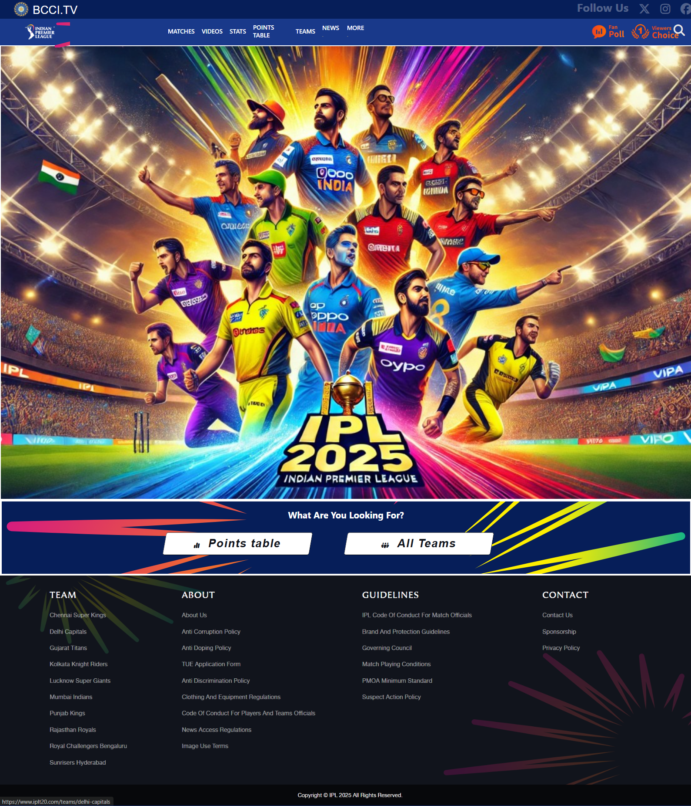

# Indian Premier League Official Website

Welcome to the official website of the Indian Premier League (IPL). This website provides comprehensive information about the IPL, including match fixtures, team details, stats, and more.



## Features

- **Matches**: Stay updated with the latest match fixtures and results.
- **Videos**: Watch exclusive videos and highlights.
- **Stats**: Access detailed statistics of players and teams.
- **Points Table**: Check the current standings of teams in the points table.
- **Teams**: Get information about all the teams participating in the IPL.
- **News**: Read the latest news and updates about the IPL.
- **More**: Explore additional features and content.

## Follow Us

Stay connected with us on social media:
- [Twitter](https://twitter.com/IPL)
- [Instagram](https://www.instagram.com/iplt20/)
- [Facebook](https://www.facebook.com/IPL)

## How to Use

1. Clone the repository:
    ```sh
    git clone https://github.com/yourusername/ipl-official-website.git
    ```
2. Navigate to the project directory:
    ```sh
    cd ipl-official-website
    ```
3. Open `index.html` in your preferred web browser to view the website.

## Contributing

We welcome contributions to improve the website. Please follow these steps to contribute:

1. Fork the repository.
2. Create a new branch:
    ```sh
    git checkout -b feature-branch
    ```
3. Make your changes and commit them:
    ```sh
    git commit -m "Add new feature"
    ```
4. Push to the branch:
    ```sh
    git push origin feature-branch
    ```
5. Create a pull request.
